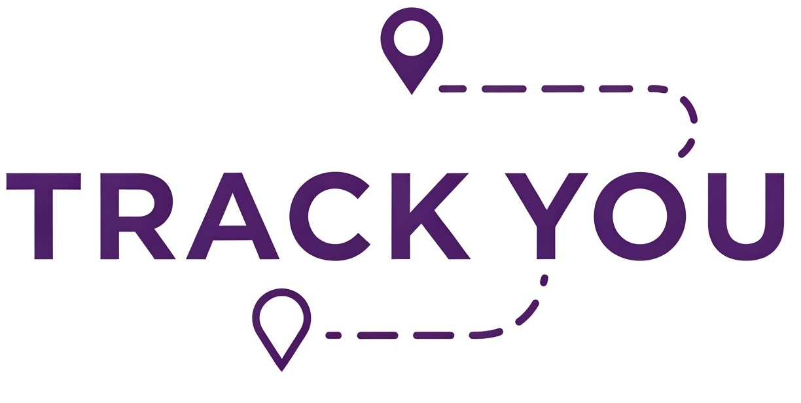

<p align="center" id="topo">
  
</p>

<h1 align="center">
    TrackYou Data PostgreSQL
</h1>

<p align="center"><strong>Navegação do projeto</strong></p>
<p align="center">
    <a href="#sobre">Sobre</a> |
    <a href="#funcionalidades">Funcionalidades</a> |
    <a href="#pré-requisitos">Pré-requisitos</a> |
    <a href="#tecnologias-utilizadas">Tecnologias utilizadas</a>
</p>

## Sobre

    Essa é uma biblioteca que implementa a biblioteca TrackYou.Data e que serve para conectar com a base de dados do PostgreSQL.
	Ela facilita a comunicação com o PostgreSQL, permitindo ao desenvolvedor focar na criação das consultas sem a necessidade de implementar a parte de conexão e tarefas relacionadas.

## Funcionalidades

- [x] Conexão com o PostgreSQL
- [x] Implementação com o PostgreSQL para trabalhar com transação(ex.: Begin, Save e Rollback)
- [x] Implementação dos métodos para recuperação, inserção, update e remoção de dados no PostgreSQL
- [x] Implementação de métodos síncronos e assíncronos

## Pré-requisitos

### Ferramentas

- [SDK .NET 8](https://dotnet.microsoft.com/pt-br/download)
- [Visual Studio Community 2022+](https://visualstudio.microsoft.com/pt-br/downloads/)
- [Git](https://git-scm.com/downloads)

### Versão do DotNet

- .Net 8
- C# 12

### Start no projeto

- Abra o prompt e execute os comandos abaixo:

```bash
# Clonar o repositório do projeto
$ git clone https://github.com/marllonramos/Infrastructure.Data.Postgres.git

# Acessar a pasta do projeto
$ cd Infrastructure.Data.Postgres

```

### Observação
	Essa biblioteca deve ser utilizada em algum projeto que deseja trabalhar com a base de dados PostgreSQL.
	Deve ser instalada via NuGet.

## Tecnologias utilizadas

- C#

<p align="right">
    <a href="#topo">Ir para o Topo</a>
</p>

<p align="center">
    Made by Marllon Nascimento Ramos - <a href="https://www.linkedin.com/in/marllon-ramos-6b9a2530/">meu linkedin</a>
</p>
